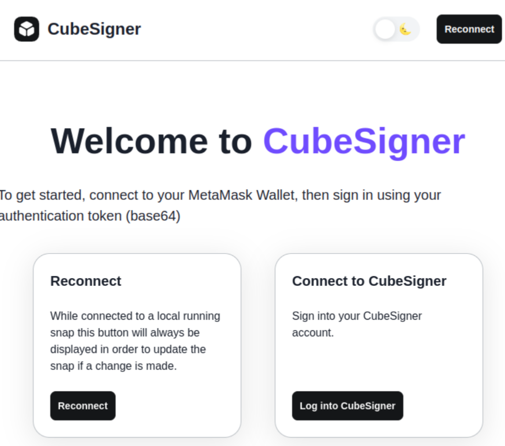
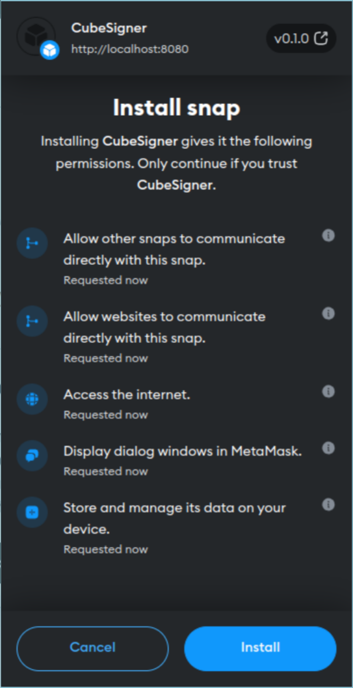
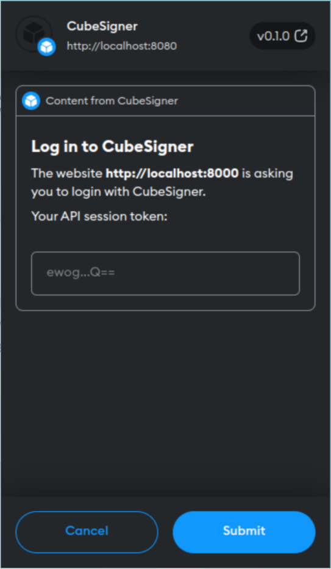
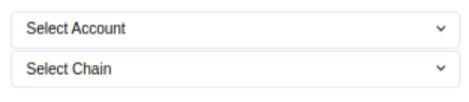
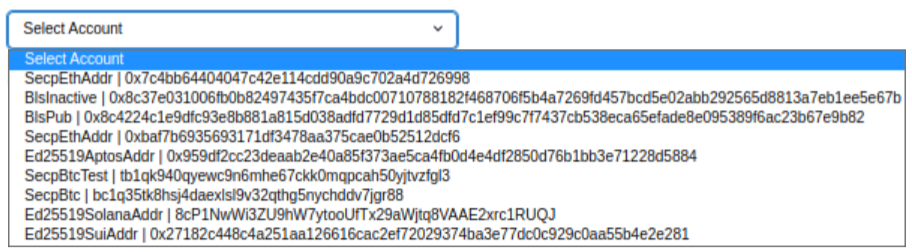
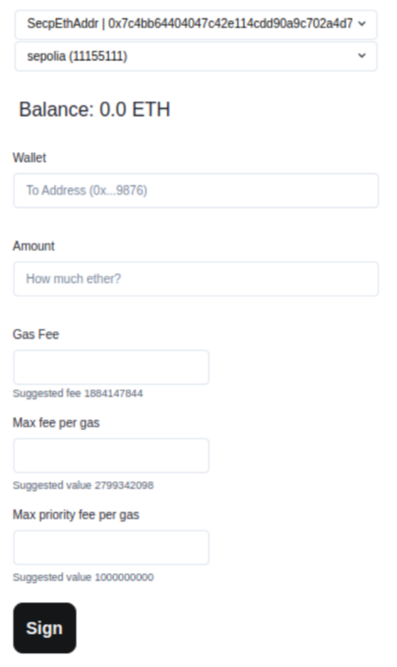

# @cubist-labs/cubesigner-snap

This repository is a demo page of using CubeSigner's Typescript SDK
via a Metamask Snap.

MetaMask Snaps is a system that allows anyone to safely expand the
capabilities of MetaMask. A _snap_ is a program that we run in an
isolated environment that can customize the wallet experience. You
will need to create a Metamask account and CubeSigner organization in
order to interact with CubeSigner-Snap.

## Getting Started

### Prerequisites

- install [MetaMask Flask](https://metamask.io/flask/), a canary
  distribution for developers that provides access to upcoming features.
- install node.js v19
- log into your CubeSigner organization using the `cs` command-line
  tool, e.g.,

  ```bash
  cs login owner@example.com --env '<gamma|prod|...>'
  ```

### Build

```bash
npm install
npm run build
```

### Run Tests

```bash
npm test
```

### Accessing the Snap

1. start the snap

   ```bash
   npm -C packages/snap run start
   ```

2. start the demo website

   ```bash
   npm -C packages/site run start
   ```

3. navigate to `http://localhost:8000` (using the browser where Metamask Flask is installed)

   

4. click `Reconnect`

   MetaMask should ask you to agree to install CubeSigner snap:

   

   Click `Install` if you trust CubeSigner.

5. click `Log into CubeSigner`

   CubeSigner snap should display a dialog to let you enter your
   CubeSigner signer session token

   

   To generate a new token for an existing role, run the following
   command from your terminal:

   ```bash
   cs token create --purpose snap --role-id $ROLE_ID --output base64
   ```

   This should print out the token;
   copy the token paste it into the snap
   dialog (and then clear your clipboard).

   You should be logged in; the home page should now display the
   following drop-down widgets.

   

   The `Select Account` drop-down should contain all the keys
   accessible from the signer session you used to log in.

   

   whereas `Select Chain` should offer `goerli (5)` and `sepoila (11155111)`.

6. Make your selections. Select one of your `Secp` keys and one of
   the chains, and the following should show up.

   
